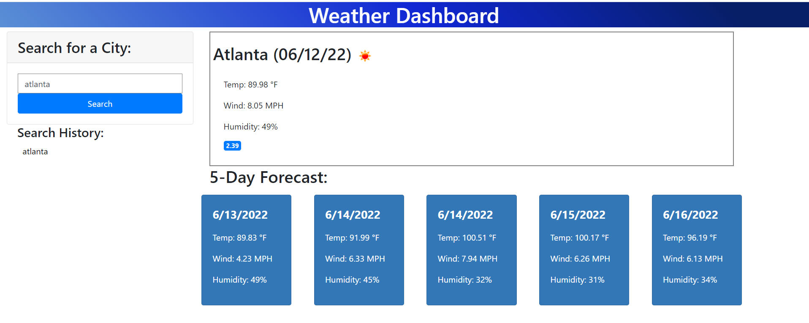

# Weather-Dashboard

The Weather Dashboard allows the user to enter a city within the USA into the search bar. The page will then display the current weather as well as a five day forecast for that city.

## Features
* Displays current weather for searched city
* Displays five day forecast for searched city
* saves searched city to local storage and displays the search history on the left-hand side

## Built With:
* HTML
* CSS
* Bootstrap
* JavaScript
* JQuery
* moment.js
* Open Weather API

## Future Enhancements:
* Have the icon display in the five day forecast
* Have only the current weather icon appended to the page and the other removed upon load with the new cities data
* Refactor the code to loop through the five day forecast and append items to the DOM (shortening both the HTML and JS code)
* Have the UV Index change color depending on its severity
* Have the search history list be clickable and for the search histories data to reapper in the current and five day forecast weather displays
* Have the code be responsive to smaller screen sizes

## Website:
https://hollenbebe08.github.io/b-griffith-weather-dashboard/

## Contributions:
* Betsy Griffith

## Deployed Site Screenshot:
